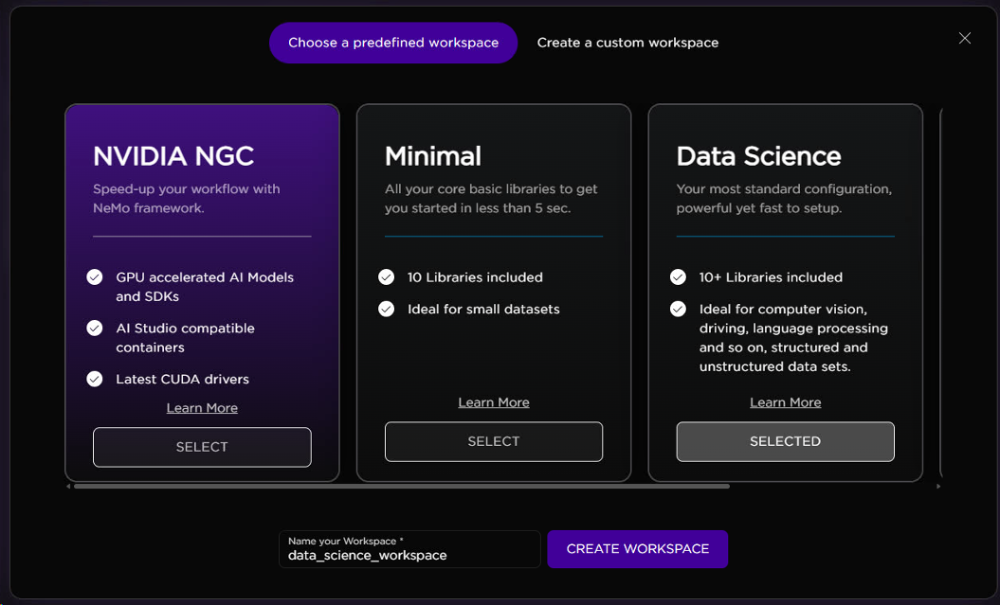
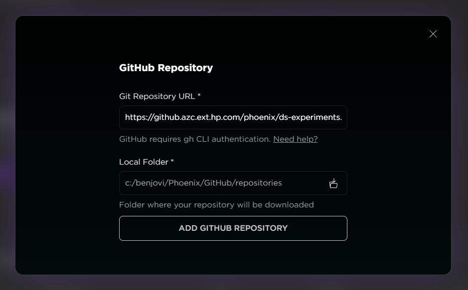

# Super Resolution
<!--  -->
<!-- colocar uma imagem aqui -->

 [1. Project Setup on AI Studio](#1-project-setup-on-ai-studio)

 [2. How to use the experiment](#2-how-to-use-the-experiment)
 
 ---

 ## 1. Project Setup on AI Studio
 ---
 ### Workspace
 For this experiment, **we highly recommend yo to create a custom workspace on AI Studio using the Data Science image**. 

 For extra libraries and specific versions, you can run the "!pip install" cell.
 
 For the memory configurations, it is not necessary GPU resources. 
 
 

---
 ### Accessing Jupyter Notebooks
 There are two ways for you to access the notebooks.
 #### First: By cloning the repo

Go to [Catalogue repository](https://github.azc.ext.hp.com/phoenix/ds-experiments/tree/draft/demo_catalogue) and copy the HTTPS URL. Next, go to your Project > Setup & Documentation > GitHub Repository and hit the CLONE GIT REPOSITORY button. Paste the URL, choose a local folder for the repository to be located and add it to the project.

 #### Second: By downloading the files from One Drive
You can access the notebook directly from this [link](https://hp-my.sharepoint.com/:u:/p/andressa_da-rosa/ESuqGi-9wFhKuIoowJi-ufcB32JWUVqvvIYrcThmbZwrTg?e=rc5uMv). 

 ---

 ## 2. How to use the experiment
 ---

Once you have set up the custom workspace and have access to the notebook, follow these steps to generate the audio transcription:

**Running the Cells:**
Execute all the cells of the notebook. This will ensure the process is completed, and you will have access to the generated audio transcription at the end of the notebook.

**Video URL Change:**
In this experiment, you have the option to change the video URL for which you want to transcribe the audio. You can do this by editing the following line in the notebook:

url = 'https://youtu.be/JAzF4yp2Ef4'

If you choose to do so, you also need to update the filename for the saved result:

result = small_model.transcribe('HP x Real Madrid  HP.mp4')