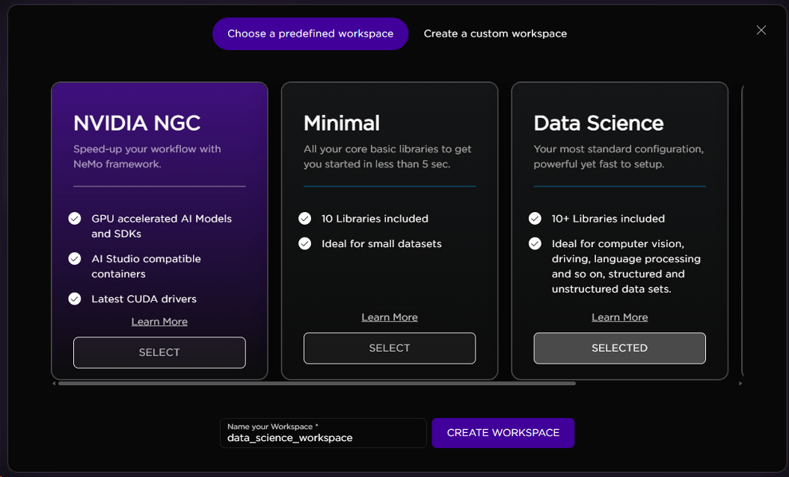
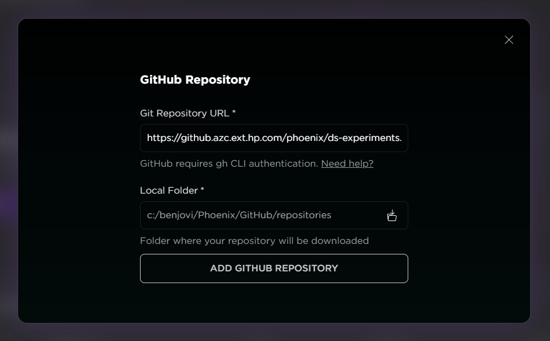

# Super Resolution
<!--  -->
<!-- colocar uma imagem aqui -->

 [1. Project Setup on AI Studio](#1-project-setup-on-ai-studio)

 [2. How to use the experiment](#2-how-to-use-the-experiment)
 
 ---

 ## 1. Project Setup on AI Studio
 ---
 ### Workspace
 For this experiment, **we highly recommend yo to create a custom workspace on AI Studio using the Data Science image**. 

 For extra libraries and specific versions, you can run the "!pip install" cell.
 
 For the memory configurations, it is not necessary GPU resources. 
 
 

---
 ### Accessing Jupyter Notebooks
 There are two ways for you to access the notebooks.
 #### First: By cloning the repo

Go to [Catalogue repository](https://github.azc.ext.hp.com/phoenix/ds-experiments/tree/draft/demo_catalogue) and copy the HTTPS URL. Next, go to your Project > Setup & Documentation > GitHub Repository and hit the CLONE GIT REPOSITORY button. Paste the URL, choose a local folder for the repository to be located and add it to the project.

 #### Second: By downloading the files from One Drive
You can access the notebook directly from this [link](https://hp-my.sharepoint.com/:u:/p/andressa_da-rosa/EXAWWqp5jr9Bq8KwLgnPst0B_OlsLtmxRLanJsW8bDsI_A?e=7dC34H). 

 ---

 ## 2. How to use the experiment
 ---

Once you have set up the custom workspace and have access to the notebook, follow these steps to generate the audio:

**Running the Cells:**
Execute all the cells of the notebook. This will ensure the process is completed, and you will have access to the generated audio at the end of the notebook.

**Language Change:**
In this experiment, you have the option to change the language of the audio to be generated. You can do this by editing the following line in the notebook:

tts = gTTS(transcription, lang="en", tld="com.br")

To change the language to Portuguese, for example, replace "en" with "pt-br":

tts = gTTS(transcription, lang="pt-br", tld="com.br")

**Editing the Text:**
If you wish to change the phrase to be generated, simply edit the text.txt file.
