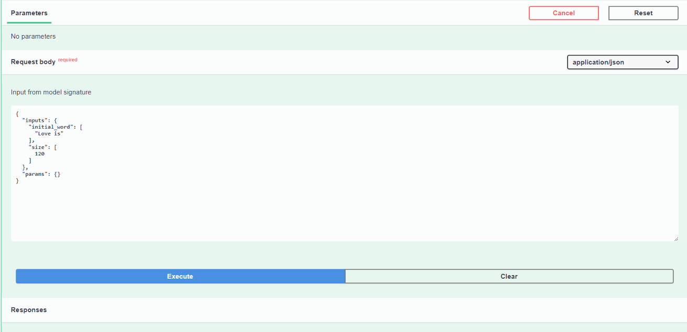

# Shakespeare text generation with RNN

 [1. Project Setup on AI Studio](#1-project-setup-on-ai-studio)

 [2. How to use the experiment](#2-how-to-use-the-experiment)
 
 ---

 ## 1. Project Setup on AI Studio
 ---
 ### Workspace
 For this experiment, **we highly recommend yo to create a custom workspace on AI Studio using the Deep Learning GPU-based image**. 

 For the memory configurations, we recommend 40 GB for Memory and 4 GB for VRAM
 
 
---
 ### Accessing Jupyter Notebooks

Go to [Catalogue repository](https://github.azc.ext.hp.com/phoenix/ds-experiments/tree/draft/demo_catalogue) and copy the HTTPS URL. Next, go to your Project > Setup & Documentation > GitHub Repository and hit the CLONE GIT REPOSITORY button. Paste the URL, choose a local folder for the repository to be located and add it to the project.

 ---

 ### How to access the trained model
 ---
 #### Hugging Face

The models are available at the [models](models/) folder, where:

- `tf_rnn_model.h5` is the trained model for the [Tensorflow Jupyter Notebook](RNN_for_text_generation_TF.ipynb)

- `dict_torch_rnn_model.pt` is the trained model for [PyTorch Jupyter Notebook](RNN_for_text_generation_Torch.ipynb) and also includes the `decoder.pt` and `encoder.pt`

---
#### Download from SharePoint (Private Group - AIS Team only)

##### [RNN models on SharePoint](https://hp.sharepoint.com/:f:/r/teams/HPDataSciencePlatform/Shared%20Documents/QA/%5BiUAT%5D%20Data%20sources/Models/RNNs?csf=1&web=1&e=1hgHAx)
---

---

 ## 2. How to use the experiment
---
Since we provide you the trained model from the training part of the experiment, there's no need for you to run it again. You can just show the training notebooks and the MLFlow on the Monitor tab for showing the results.

For deploying the model, you have to run the Deployment.ipynb notebook for registering the model using MLFlow. Then, you go to Published Servicies, create a new deploy, select the model and the (latest) version and start it. After a while, you can click on the URL and access the Swagger UI for sending a initial word for the model and the size of the text. Click on POST/invocations > Try it out and edit the request body. 

`initial_word`: the initial word of the text to be generated

`size`: the size the generated text can be

---