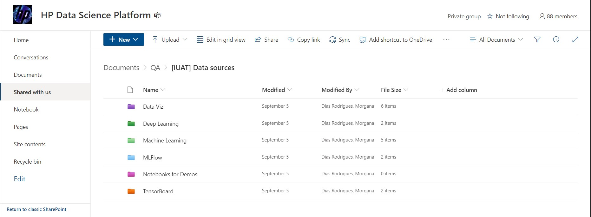
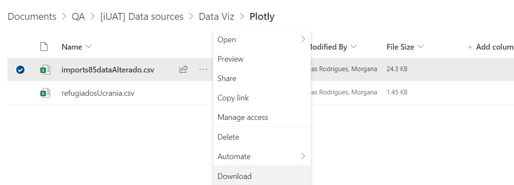

## Data Science Experiments repo

### This repository is dedicated to gathering experiments and scripts for internal User Acceptance Testing (iUAT) purposes on the Phoenix platform.
----------

#### Internal Nomenclatures:
##### **Experiment:** Contains machine learning and/or deep learning algorithms within a complete pipeline (EDA, preprocessing, etc).
##### **Script:** Does not contain machine learning and/or deep learning algorithms and is solely used to test inherent functionalities of task frameworks.

---
#### Descriptions

**Deep Learning** - experiments that use the two main frameworks in the field, tensorflow and torch.

**Machine Learning** - experiments that use the main frameworks in the field such as sklearn and xgboost.

**MLFlow** - This folder collects some experiments  from the Machine Learning and Deep Learning folders that have been modified to use MLFlow methods.

**TensorBoard** - This folder collects some experiments from the Machine Learning and Deep Learning folders and also some scripts that have been modified to use TensorBoard methods.

**Data Visualization** - scripts with the main frameworks used for this task.

**Web Scrap** - scripts that use the main frameworks for data scraping, such as bs4 and URlib.

**Notebooks for Demos** - Selected scripts and experiments made for live demonstrations of Phoenix following specific requirements such as time of execution.

**Temp** - Temporary files that need to be organized, remade or deleted.

---

### Where to get the datasets

#### 1. Share Point

[[iUAT] Data Sources](https://hp.sharepoint.com/:f:/t/HPDataSciencePlatform/Egx7evqicM5Poxr0aA7BwXABwLS4O1SY7FPjd5LEFKRAPQ?e=klCxGk)

The main folder names are the same as those in the repository. To download the dataset you want, simply go to the corresponding folder of the experiment/script you're interested in using within SharePoint, click on the three dots, and select 'Download,' as shown in the image below:

---

#### 2. S3 Bucket
Path: `s3://phoenix-dev-bkt/[iUAT] Data Sources/`

Use this path when creating your project on Data Fabric.