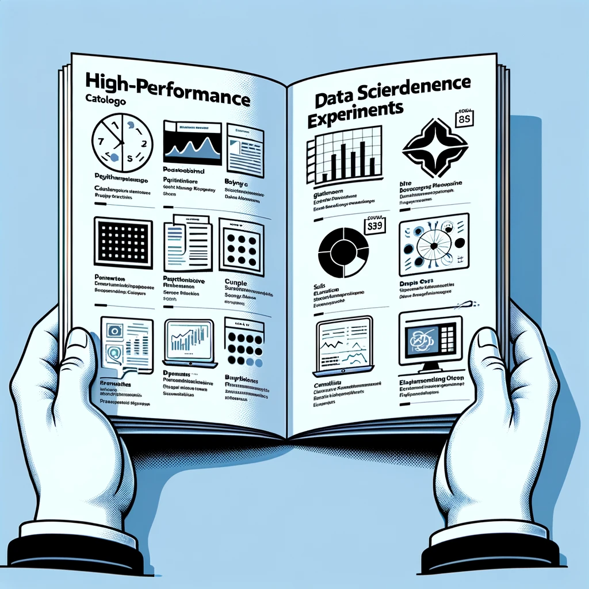

# Catalog of experiments for AI Studio demonstrations

### Welcome! 🙂

Find the best experiments to showcase the main features of the AIS. Browse the catalog and explore the offered experiments. All the step-by-step instructions for the experiments are documented for easy reproduction by you.

---

### 01. [AI Studio Features 😎](AI_Studio_Features/)
*Here you will find experiments to demonstrate specific features of the AI Studio, such as local deployment, monitor tab, and data fabric.*

---

### 02. [Classic ML Experiments 🤖](Classic_ML/)
*This directory contains experiments with more classical machine learning models such as classification and regression, clustering, and time series.*

---

### 03. [Audio Experiments 🔉](Audio_Experiments/)
*What about audio experiments on AI Studio? Here you'll find the best experiments involving the training and inference of deep learning models with audio-related tasks, such as voice-to-text and text-to-voice conversion. Recommended for showcasing features related to GPU, Monitor Table, NEMO (Nvidia's Experiment Management System), and Nvidia technology. TOffers models for inference via Hugging Face.*

#### **💚 Offers NVIDIA NGC examples**
---

### 04. [Computer Vision Experiments 📸](Computer_Vision/)
*Want to show the audience how to train and make inferences with models and architectures that involve images as input and/or output? Here you'll find the best experiments to showcase these features. Various deep learning models, from img-to-img to generative models!*

---

### 05. [NLP Experiments 📄](Natural_Language/)
*Are you interested in demonstrating classic language models for various NLP tasks within AI Studio? Here you'll find the best experiments to show how to train and make inferences with classic language models like BERT, spaCy, and many others involving classic tasks such as question answering.*

---

### 06. [LLM Experiments 🦙](LLM_experiments/)
*How about showcasing the most popular LLMs within AI Studio? Here you'll find the best experiments using the latest technologies in the field of LLMs like LLaMa 2 and Pythia, in addition to orchestrators like LangChain!*